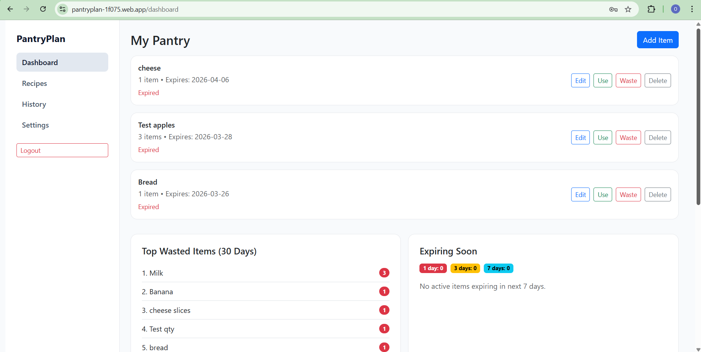
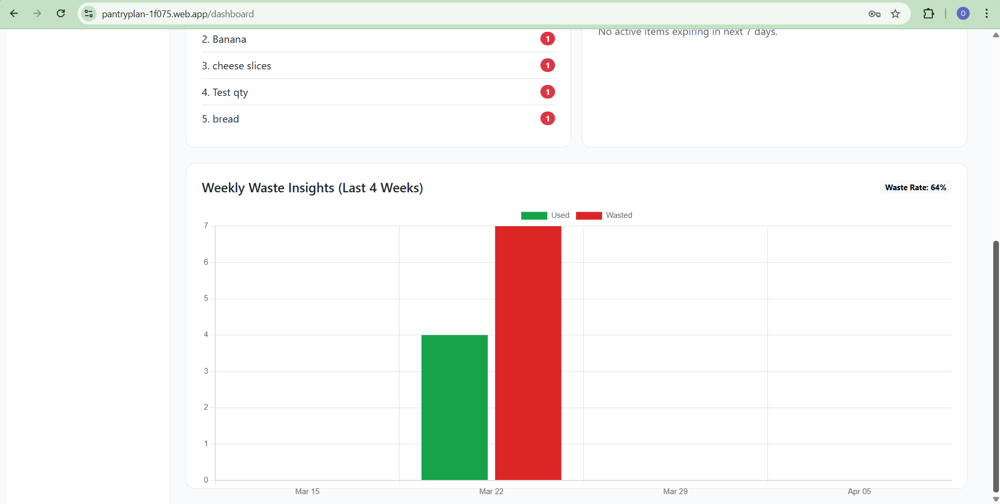
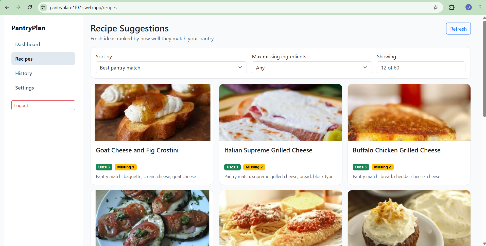
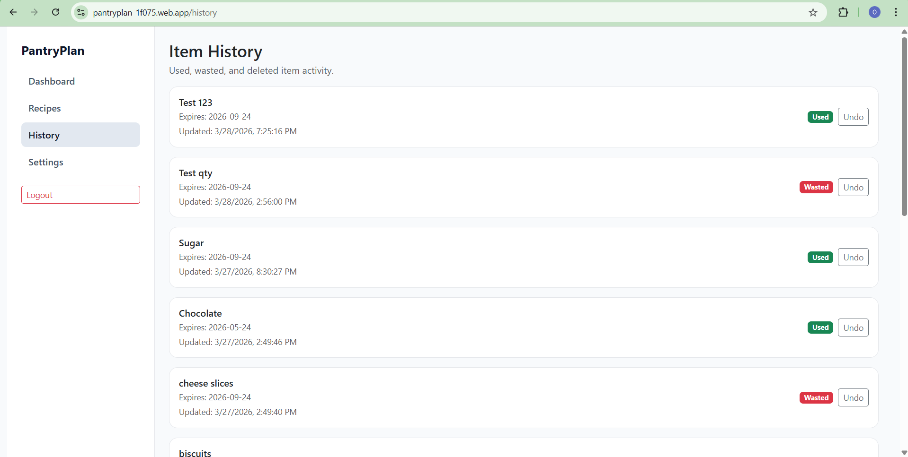
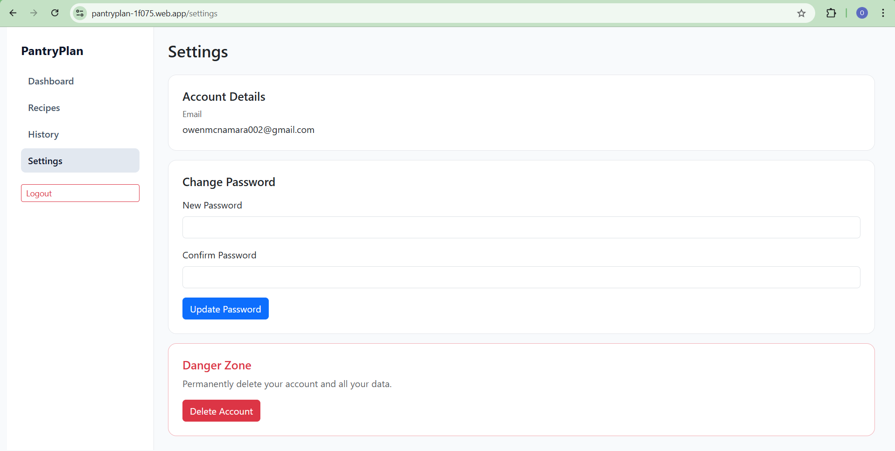

# PantryPlan

A pantry management web app built with Vue 3 and Firebase. Track food items, get expiry alerts, reduce waste, and discover recipes based on what you have.

## Live Demo

[PantryPlan](https://pantryplan-1f075.web.app/register)

## Features

- **Pantry Tracking**: Add, edit, and delete pantry items with quantity, unit, and expiry date
- **Expiry Date Scanner**: Scan product expiry dates using your camera — powered by Google Cloud Vision API
- **Expiry Alerts**: Color-coded expiry indicators and daily email notifications for items expiring within 3 days
- **Waste Insights**: Weekly bar chart of used vs. wasted items with waste rate tracking
- **Top Wasted Items**: See which items you waste most over the last 30 days
- **Recipe Suggestions**: Get recipe ideas based on your current pantry
- **History**: View all used, wasted, and deleted items with undo support
- **Auth**: Firebase Authentication with protected routes

## Tech Stack

| Layer | Tech |
|---|---|
| Frontend | Vue 3, Vite, Bootstrap 5, Chart.js |
| Backend | Firebase Cloud Functions (Node.js) |
| Database | Firestore |
| Auth | Firebase Authentication |
| Hosting | Firebase Hosting |
| OCR | Google Cloud Vision API |
| CI/CD | GitHub Actions |

## Screenshots

### Dashboard
| | |
|---|---|
|  |  |

### Pages
| Recipes | History | Settings |
|---|---|---|
|  |  |  |


## Deployment

Deploys automatically to Firebase Hosting on push to `main` via GitHub Actions. Manual deploy:

```sh
npm run deploy:all
```

## Cloud Functions

| Function | Description |
|---|---|
| `addProduct` | Add a pantry item |
| `getProducts` | Fetch active pantry items |
| `updateProduct` | Edit item name, expiry, quantity, unit |
| `updateProductStatus` | Mark item as used or wasted |
| `undoProductStatus` | Restore item to active |
| `deleteProduct` | Soft-delete an item |
| `getHistory` | Fetch used/wasted/deleted items |
| `getWeeklyAnalytics` | Weekly used vs. wasted chart data |
| `getInsightsSummary` | Top wasted items + expiring soon |
| `getRecipeSuggestions` | Recipe ideas from pantry |
| `getRecipeDetails` | Full recipe detail |
| `dailyExpiryCheck` | Scheduled email alerts (every 24h) |
| `scanExpiry` | 	Scan expiry date from image using Google Cloud Vision API |

## Project Structure

```
pantry_plan/
├── images/
├── functions/          # Firebase Cloud Functions
├── src/
│   ├── pages/          # Route-level Vue components
│   ├── components/     # Shared components
│   ├── services/       # API + auth helpers
│   ├── router/         # Vue Router config
│   └── styles/         # CSS tokens, base, components
├── .github/workflows/  # CI/CD pipeline
└── firebase.json       # Firebase config
```

## License

MIT
